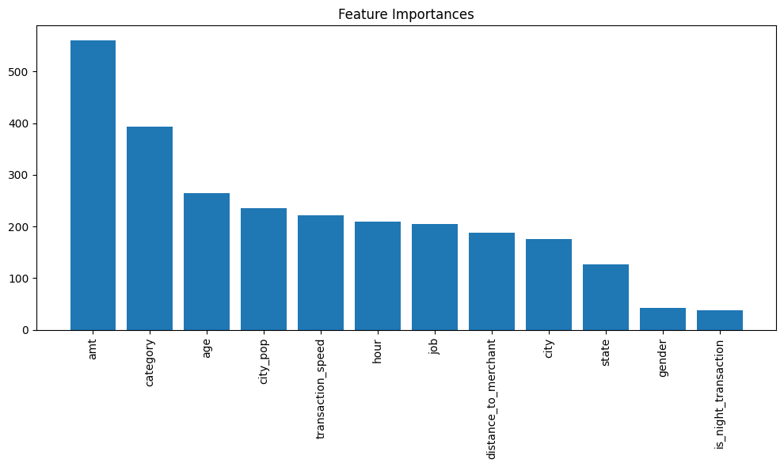

# Fraud Detection Machine Learning Project

Bu proje, kredi kartı işlemlerinde dolandırıcılık tespit etmek için bir makine öğrenimi sınıflandırma modeli geliştirmeyi amaçlamaktadır. Veri seti, kredi kartı işlemlerine ait çeşitli özellikleri ve işlemin dolandırıcılık olup olmadığını belirten bir etiketi içermektedir.

## Proje Yapısı

### Dosyalar ve Klasörler
- **`eda.ipynb`**: Veri keşfi ve analiz (EDA) işlemlerini içerir. Veri setinin genel özellikleri, eksik değerler, aykırı değerler ve dağılımlar analiz edilmiştir.
- **`feature_engineering.ipynb`**: Özellik mühendisliği işlemleri gerçekleştirilmiştir. Yeni özellikler oluşturulmuş ve gereksiz sütunlar çıkarılmıştır.
- **`algoritmalar.ipynb`**: Farklı makine öğrenimi algoritmalarının karşılaştırıldığı ve en iyi modelin seçildiği dosya.
- **`fraud_detection.csv`**: Orijinal veri seti.
- **`fraud_detection2.csv`**: Özellik mühendisliği sonrası işlenmiş veri seti.

## Kullanılan Teknolojiler ve Kütüphaneler
- **Python**: Projenin temel programlama dili.
- **Pandas**: Veri işleme ve analiz.
- **NumPy**: Sayısal hesaplamalar.
- **Matplotlib & Seaborn**: Veri görselleştirme.
- **Scikit-learn**: Makine öğrenimi modelleri ve metrikler.
- **XGBoost**: Gelişmiş sınıflandırma algoritması.
- **Geopy**: Coğrafi mesafe hesaplama.

## Veri Seti
Veri seti, kredi kartı işlemlerine ait şu özellikleri içermektedir:
- **`amt`**: İşlem tutarı.
- **`category`**: İşlem kategorisi.
- **`city_pop`**: Kart sahibinin yaşadığı şehrin nüfusu.
- **`is_fraud`**: İşlemin dolandırıcılık olup olmadığını belirten etiket (0: Dolandırıcılık değil, 1: Dolandırıcılık).

### Veri Ön İşleme
- Eksik değerler temizlendi.
- Gereksiz sütunlar çıkarıldı.
- Yeni özellikler oluşturuldu:
  - **`distance_to_merchant`**: Kullanıcı ile satıcı arasındaki mesafe.
  - **`is_night_transaction`**: Gece yapılan işlemleri belirten özellik.
  - **`transaction_speed`**: İşlemler arasındaki süre farkı.

## Modelleme
Farklı makine öğrenimi algoritmaları kullanılarak modeller eğitildi ve değerlendirildi:
- **Random Forest**
- **Logistic Regression**
- **Decision Tree**
- **XGBoost**
- **Support Vector Machine (SVM)**

### Performans Metrikleri
Modeller, aşağıdaki metrikler kullanılarak değerlendirildi:

Validation Set Performance:

                Model  Accuracy  Precision    Recall  F1-Score
0        RandomForest  0.969618   0.975309  0.965377  0.970317
1  LogisticRegression  0.765846   0.771023  0.774949  0.772981
2        DecisionTree  0.962284   0.963340  0.963340  0.963340
3             XGBoost  0.979047   0.975758  0.983707  0.979716
4                 SVC  0.515977   0.524493  0.632383  0.573407

### En İyi Model
- **XGBoost**: Validation ve test setlerinde en iyi performansı gösterdi.

## Özellik Önem Sıralaması
XGBoost modeli kullanılarak özelliklerin önem sıralaması görselleştirildi. En önemli özellikler:



## Nasıl Çalıştırılır?
1. Gerekli kütüphaneleri yükleyin:
   ```bash
   pip install pandas numpy matplotlib seaborn scikit-learn xgboost geopy
   ```

2. Veri setini **fraud_detection.csv** olarak proje dizinine yerleştirin.

3. Aşağıdaki adımları sırasıyla çalıştırın:

* eda.ipynb: Veri analizi.
* feature_engineering.ipynb: Özellik mühendisliği.
* algoritmalar.ipynb: Model eğitimi ve değerlendirme.

Sonuçlar ve Öneriler
Dolandırıcılık işlemleri genellikle yüksek işlem tutarlarında ve düşük şehir nüfuslarında yoğunlaşmıştır.
Gece saatlerinde yapılan işlemler dolandırıcılık açısından daha riskli olabilir.
Özellik mühendisliği ve dengesiz veri seti sorunlarının ele alınması, model performansını artırmıştır.

İletişim
Herhangi bir sorunuz veya öneriniz varsa, lütfen benimle iletişime geçin:

E-posta: sakirbetul@outlook.com
